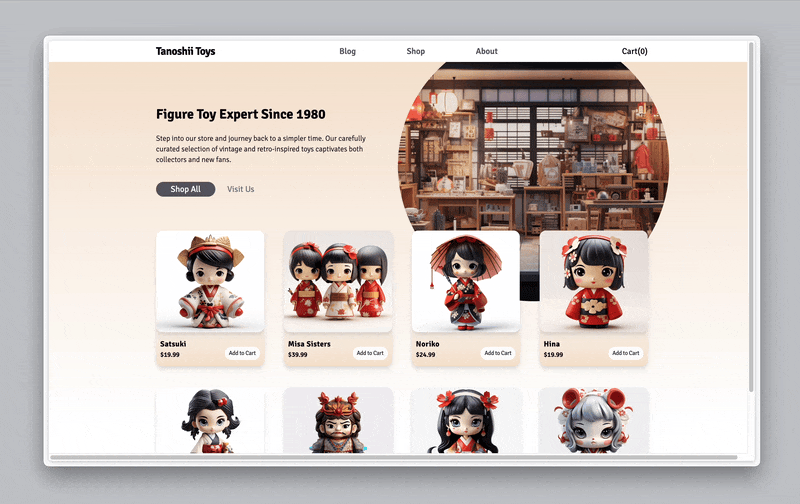

# Day 003 Figure Toy Shop

### Demo:
*It takes several seconds to load the demo, thanks for your patience.* :relaxed:


### Knowledge:
This single-page figure shop is a simplified version of an online shop that includes essential elements of a shopping website. It also includes the functionality of adding items to the shopping cart and modifying the items' quantities inside the cart. Achieving this uses the React knowledge like `useContext`, `useReducer`, etc., and the interface is styled with Tailwindcss.

### How to run the file:
Open the terminal and navigate to this folder, then excuting the following commands to install the necessary packages:
```bash
npm install
npm install -D tailwindcss postcss autoprefixer
rpx tailwindcss init -p
```
Then use
```bash
npm run dev
```
*note: please refer [Tailwindcss Vite/React](https://tailwindcss.com/docs/guides/vite#react) for the required configuration for Tailwindcss*

to activate the local server, paste the link showing in termial that starts with ``http://localhost:****/`` (where `****` is a 4-digit port number that varies between machines) to the browser.

### Provisional Use Case:
- Online Shopping Website
