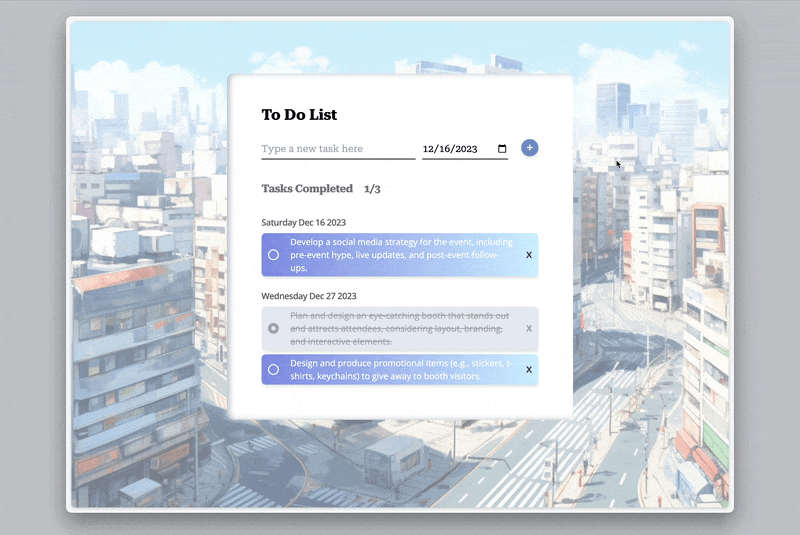

# Day 004 Todo List

### Demo:
*It takes several seconds to load the demo, thanks for your patience.* :relaxed:


### Knowledge:
This simple Todo List helps handle the task items and organize them by date. It has interactive features like warnings when adding nothing and add/remove/mark-as-completed functionalities with distinctive visual styles for the complete/incomplete tasks. Achieving this uses React knowledge like `useEffect`, `useState`, and JavaScript syntaxes like `localStorage` to avoid missing data when refreshing the page and `setTimeout` for the warning effects.

### How to run the file:
Open the terminal and navigate to this folder, then excuting the following commands to install the necessary packages:
```bash
npm install
npm install -D tailwindcss postcss autoprefixer
rpx tailwindcss init -p
```
Then use
```bash
npm run dev
```
*note: please refer [Tailwindcss Vite/React](https://tailwindcss.com/docs/guides/vite#react) for the required configuration for Tailwindcss*

to activate the local server, paste the link showing in termial that starts with ``http://localhost:****/`` (where `****` is a 4-digit port number that varies between machines) to the browser.

### Provisional Use Case:
- Todo list, as it shows