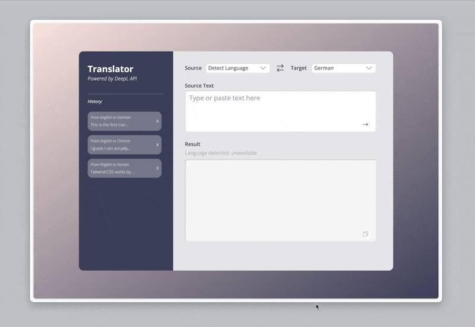

# Day 005 Translation App with DeepL API

### Demo:
*It takes several seconds to load the demo, thanks for your patience.* :relaxed:


### Knowledge:
This web application is a simple tool for language translation, integrating the DeepL API for its core functionality. Users can input text in a designated field and click the translation button to send request to DeepL and receive either result or error messages, and users are able to copy the result but simply clicking the `copy` button places in the result text area. It also uses `localStorage` to save translation histories. 

### How to run the file:
Open the terminal and navigate to this folder, then excuting the following commands to install the necessary packages:
```bash
npm install
npm install -D tailwindcss postcss autoprefixer
rpx tailwindcss init -p
```

It also uses `axios` to send translation request and receive results:
```bash
npm install axios
```

Then use
```bash
npm run dev
```
*note: please refer [Tailwindcss Vite/React](https://tailwindcss.com/docs/guides/vite#react) for the required configuration for Tailwindcss*

to activate the local server, paste the link showing in termial that starts with ``http://localhost:****/`` (where `****` is a 4-digit port number that varies between machines) to the browser.

### Provisional Use Case:
- NLP related tasks not limited to translation but also scenarios like emotional assessment, question answering, etc.