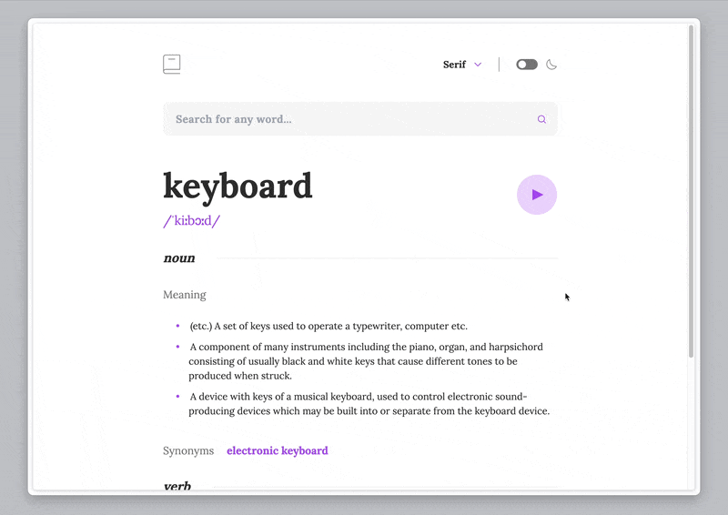

# Day 006 Dictionary App

### Demo:
*It takes several seconds to load the demo, thanks for your patience.* :relaxed:


### Live Demo Link: 
-> [Dictionary](https://clickvisionstudio.github.io/responsive_dict_app/)

### Knowledge:
This is a responsive dictionary app for looking up word definitions and pronunciation using the [Free Dictionary API](https://dictionaryapi.dev/). The user can also switch between dark/light themes and multiple font types by interacting with the app's header; the app is also adaptive to different screen sizes.

### How to run the file:
Open the terminal and navigate to this folder, then excuting the following commands to install the necessary packages:
```bash
npm install
npm install -D tailwindcss postcss autoprefixer
rpx tailwindcss init -p
```

Then use
```bash
npm run dev
```
*note: please refer [Tailwindcss Vite/React](https://tailwindcss.com/docs/guides/vite#react) for the required configuration for Tailwindcss*

to activate the local server, paste the link showing in termial that starts with ``http://localhost:****/`` (where `****` is a 4-digit port number that varies between machines) to the browser.

### Provisional Use Case:
- Dictionary or similar Loop-up tasked apps.