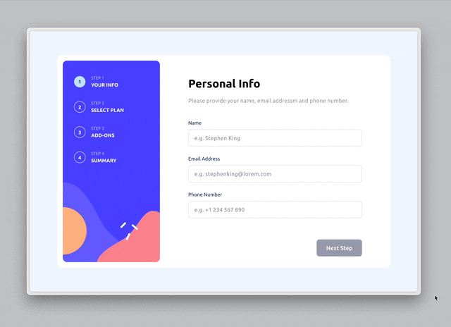

# Day 009 Markdown Editor

### Demo:
*It takes several seconds to load the demo, thanks for your patience.* :relaxed:


### Live Demo Link: 
-> [Markdown Editor](https://clickvisionstudio.github.io/multistep_form/)

### Knowledge:

This Multistep Form project is implemented with `React,` using `react-router` for multipage management and `redux-toolkit` for form state management; the page is styled with `Tailwindcss` and features an adaptive design that fits both desktop and mobile screens. This form includes customized components including different types of text input with their respective constraints and validations, radio inputs that represent with clickable cards, toggle switch which allow user switch between subscription periods, and check boxes for the multi-value field.

*This is a frontend challenge on Frontendmentor.io, and here's the link to that challenge: [Frontend Mentor](https://www.frontendmentor.io/challenges/multistep-form-YVAnSdqQBJ)*

### How to run the file:
Open the terminal and navigate to this folder, then excuting the following commands to install the necessary packages:
```bash
npm install
```

Then use
```bash
npm run dev
```
*note: please refer [Tailwindcss Vite/React](https://tailwindcss.com/docs/guides/vite#react) for the required configuration for Tailwindcss*

to activate the local server, paste the link showing in termial that starts with ``http://localhost:****/`` (where `****` is a 4-digit port number that varies between machines) to the browser.

### Provisional Use Case:
- Online orders like food order, subscription form, etc.