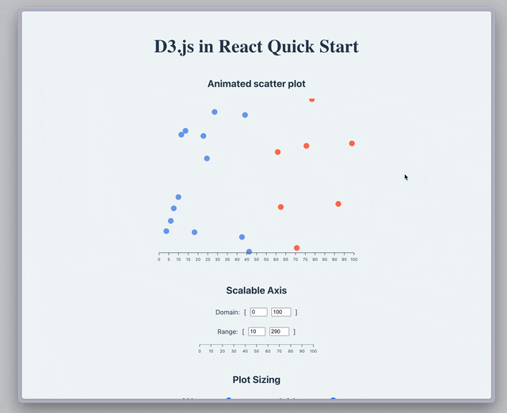

# Day 011 D3.js in React Quick Start

### Demo:
*It takes several seconds to load the demo, thanks for your patience.* :relaxed:


### Live Demo Link: 
-> [D3js Plot](https://clickvisionstudio.github.io/d3js_plot/)

### Knowledge:

This project implements basic `D3js` visualization components in `React`. The contents generally follow Amelia Wattenberger's [React + D3.js](https://2019.wattenberger.com/blog/react-and-d3) post but are written in a more declarative way that further divides plot elements into React components. This mini-project is a starting point for several larger data visualization projects.


### How to run the file:
Open the terminal and navigate to this folder, then excuting the following commands to install the necessary packages:
```bash
npm install
```

Then use
```bash
npm run dev
```
to activate the local server, paste the link showing in termial that starts with ``http://localhost:****/`` (where `****` is a 4-digit port number that varies between machines) to the browser.

### Provisional Use Case:
- Interactive data visualizations.